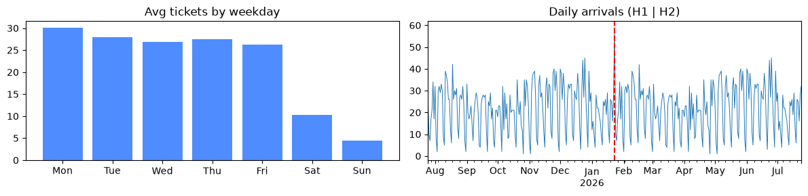
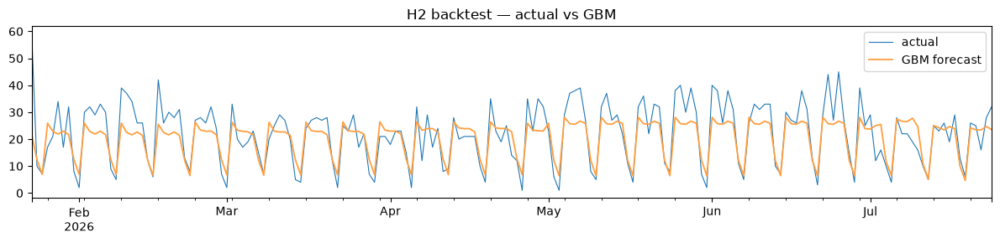
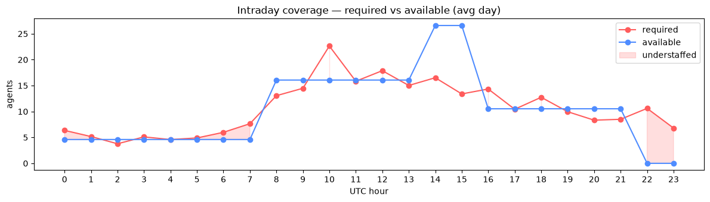
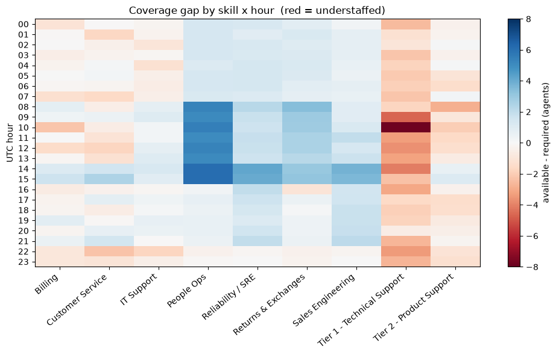
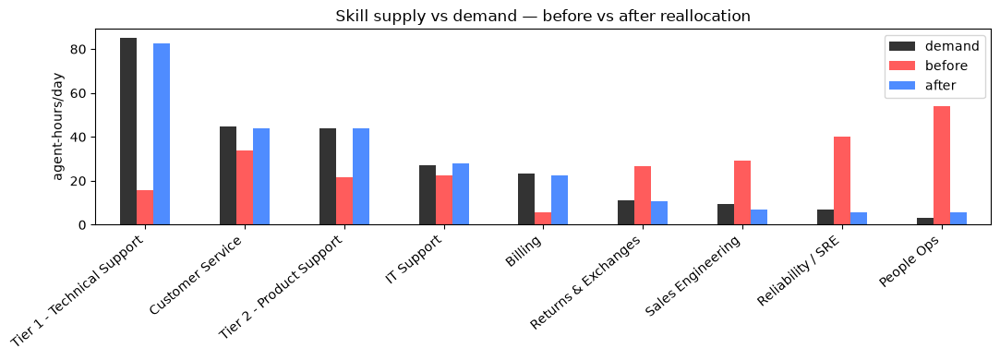

# 00 · Workforce Optimization for B2B Support — Problem, Solution & Results

> The flagship feature of the AI Operations Platform: given a B2B / outsourced
> support operation, **is the workforce aligned with the demand — and if not,
> what should change?** This document states the problem, the solution pipeline,
> and the **actual measured results** on our dataset.

---

## Executive summary

Support operations routinely lose money two ways at once: **understaffing** the
busy skills/hours (SLA breaches, unhappy clients) while **overstaffing** the quiet
ones (idle, paid agents). The hard part isn't predicting volume — it's matching a
skilled, shifted, multi-timezone workforce to that volume.

We built a four-stage pipeline — **forecast → capacity → gap → optimize** — over a
Zendesk-shaped dataset whose demand timing is calibrated to a real call-center's
operations. The headline finding:

> **The forecast is easy — it sits at the statistical noise floor. The real value
> is the workforce's _skill mix_: demand concentrates in Tier 1/2 Technical
> Support while agents are spread across niche areas. A greedy reallocation of
> just ~22 agents (3 immediate reassignments + 19 cross-training moves) cuts
> unmet demand by 93% (124 → 8 agent-hours/day).**

---

## 1. The problem

**Who it's for.** Support managers, WFM/operations leads, and account managers at
an outsourcing shop (FlairsTech's model) running many clients, dozens of agents,
multiple skills, and several timezones.

**What goes wrong.** Staffing is planned manually against gut feel. The result is
a persistent mismatch between **supply** (who is skilled and on shift, when) and
**demand** (ticket volume by time, skill, and client):

- **Understaffed** high-demand skills/hours → SLA breaches, backlog, churn risk.
- **Overstaffed** low-demand skills/hours → idle paid capacity, wasted cost.
- No visibility into **which** skills/clients/hours are exposed, or **what move**
  fixes it.

**The question this feature answers:** *Where is the workforce misaligned with
demand, and what is the minimal set of reassignment / cross-training moves that
closes the gap — respecting each agent's skills, timezone, and client priority?*

---

## 2. Data foundation (and how honest it is)

The feature runs on a frozen, Zendesk-shaped dataset (the source of truth):

- **8,000 tickets** over a **real-calibrated 12-month calendar** (2025-07-25 →
  2026-07-24), with comments, `ticket_metrics`, `ticket_audits`, SLA events.
- **Workforce layer** (see `docs/workforce-data-model.md`): 45 agents (skills,
  timezone, tier, cost, capacity), 1,823 shifts, time-off, **120 client
  contracts**, and a skills taxonomy (Support Area / Product / Language / Tier).

**What is real vs. calibrated vs. synthetic — stated plainly:**

- **Demand timing** is **calibrated to real operations** — the arrival
  seasonality (intraday peak, weekday shape, monthly trend) was fitted from the
  **Technion "AnonymousBank" dataset — 444,436 real calls (1999)** and stamped
  onto our tickets. Weekly pattern reproduced to within ~5%.
- **Ticket durations & SLA** are **ours** (hours-scale, ticket-native) — we do
  **not** import phone handle-times.
- **The skill taxonomy** was extracted from real ticket text by **GPT-5 Mini**
  (e.g. *Cisco ISR4331*, *Dell XPS 13*, *MacBook Air M1*, *Jira*, *Zoom*) — detail
  that only exists in the unstructured subjects.
- **Shifts / cost / contracts** are synthetic but grounded (agent skills from
  their actual handled queues; contracts from each client's real ticket mix).

The result is a **defensible proof-of-concept**: grounded structure, not
fabricated blindly, with every assumption labeled.

---

## 3. The solution — a four-stage WFM pipeline

Validated end-to-end in `backend/notebooks/01–04` (each executed with embedded
plots). The stages:

### 3.1 Demand forecasting

Aggregate the calibrated arrivals into a **daily demand series** (mean ~22
tickets/day) with strong weekly seasonality, then run a **model bake-off** —
train on the first half (H1), backtest on the second (H2).

*Weekday-heavy, weekend-light (the calibrated profile); the red line marks the
H1 | H2 split.*

| Model | MAE | RMSE | MAPE |
|---|---|---|---|
| Seasonal-naive (weekday mean) | 4.64 | 6.32 | 23.1% |
| Holt-Winters (weekly) | 5.84 | 7.60 | 28.0% |
| **Gradient Boosting (calendar)** | 4.93 | 6.63 | **22.5%** |

**Key finding — we're at the noise floor.** MAE ≈ **√mean (4.69)** = the
irreducible **Poisson arrival variance**. The weekly-seasonality signal is fully
captured; no model can do better on the *forecast*. GBM is the pick (best MAPE,
extends to per-skill). **So the forecast is not where the value is.**

### 3.2 Capacity model

Convert demand + **agent-occupied handle time** (triage + 12 min/reply; median
**30 min**, p90 66 min — *not* elapsed resolution) into **required agents per
interval**, and compare with **available shift capacity** (UTC, follow-the-sun,
minus time-off).

- **Scale honesty:** 8k tickets/yr is a *fraction* of a 45-agent operation (raw
  occupancy **5.2%**), so an explicit, labeled **volume scale factor S = 15.5×**
  (sample→operation) sizes the math to ~80% occupancy.
- The roster is **misaligned with demand**: **34% of (day, hour) slots
  understaffed, 45% overstaffed**. The **10:00 demand peak is understaffed**
  (required 22.6 vs available 16.1) while afternoons are overstaffed and late
  nights have coverage gaps.

### 3.3 Coverage gap — by skill and client

Break required vs available down **by skill (area) × hour**, and rank clients by
exposure to understaffing.

The structural problem, in numbers (avg agents/hour summed over the day):

| Skill | required | available | gap |
|---|--:|--:|--:|
| **Tier 1 – Technical Support** | 84.9 | 21.3 | **−63.6** |
| Tier 2 – Product Support | 43.8 | 26.5 | −17.3 |
| Customer Service | 44.6 | 38.7 | −5.9 |
| Billing | 23.1 | 17.8 | −5.3 |
| IT Support | 27.0 | 28.1 | +1.1 |
| Sales Engineering | 9.4 | 39.9 | **+30.5** |
| Returns & Exchanges | 10.9 | 42.0 | **+31.0** |
| Reliability / SRE | 7.1 | 45.8 | **+38.7** |
| People Ops | 3.1 | 59.5 | **+56.4** |

Agent skills are spread ~uniformly across areas, but **demand concentrates in
Tier 1/2 Technical Support** — so those are badly understaffed while niche areas
are heavily overstaffed. **60 of 216** skill×hour cells are understaffed; net
shortage **−117 agent-hours/day**.

### 3.4 Reassignment optimizer

A greedy reallocation: move each over-staffed-skill agent (at most once) to the
most under-staffed skill they can serve — **preferring agents who already hold the
skill** (immediate reassignment), otherwise recommending **cross-training** —
respecting skills, timezone, and dedicated-client priority.

**Result:** **before** (red) is badly misaligned — Tier 1 near-empty (16) while
People Ops (54) and SRE (40) are bloated; **after** (blue) tracks demand almost
exactly.

| Metric | Value |
|---|---|
| Unmet demand — **before** | 124 agent-hours/day |
| Unmet demand — **after** | **8 agent-hours/day** |
| **Reduction** | **93%** |
| Agents moved | **22** (3 reassign · 19 cross-train) |
| Moves into | Tier 1 (12), Tier 2 (4), Billing (3), Customer Service (2), IT (1) |

---

## 4. Results at a glance

| Stage | Headline result |
|---|---|
| Forecast | GBM ≈ optimal; **MAE 4.93 ≈ noise floor √22** — forecast is *not* the lever |
| Capacity | **34% understaffed / 45% overstaffed** slots; peak 10:00 understaffed |
| Gap | Tier 1 short by **−63.6**; People Ops/SRE over by **+56 / +39** |
| Optimize | **Unmet 124 → 8 agent-h/day (−93%)** with **22 moves** |

**Business translation:** the operation is paying for idle capacity in niche
skills while breaching on the busy ones. Reallocating/cross-training ~22 agents
(under half the roster) recovers ~90% of the shortfall — a concrete, low-effort,
high-ROI change.

---

## 5. AI techniques used

| Technique | Where |
|---|---|
| **GenAI (GPT-5 Mini)** | Skill-taxonomy extraction from ticket text; dataset variant paraphrasing |
| **Statistical calibration** | Fitting the arrival/seasonality + staffing profiles from real call-center data |
| **Time-series ML** | Demand forecasting (Gradient Boosting vs Holt-Winters vs seasonal-naive) |
| **Operations research / greedy optimization** | Skill-constrained reassignment & cross-training |

---

## 6. Honest assumptions & caveats

- **Volume scale factor (15.5×)** — the ticket sample is small for a 45-agent
  roster; scaling to realistic occupancy is a *labeled* PoC assumption.
- **Forecast noise floor** — the demand seasonality is calibrated-and-designed, so
  the forecast proves the *pipeline*, not real-world accuracy.
- **Current-period staffing** — there is no true future; the forecast is validated
  on the held-out H2 half.
- **Synthetic-but-grounded** — cost/shifts/contracts are generated (calibrated &
  grounded), not real HR/finance data.
- **Not claimed:** absolute headcount promises, real cost savings figures, or that
  phone-derived patterns perfectly match ticket behavior.

---

## 7. Reproducibility & next steps

- **Notebooks** (`backend/notebooks/`): `01_demand_forecast`, `02_capacity`,
  `03_coverage_gap`, `04_optimizer` — each executed with the plots above.
- **Artifacts** (`data/processed/`): `demand_forecast_backtest`,
  `capacity_hourly`, `gap_by_skill_hour`, `skill_totals`, `client_risk`,
  `reassignment_recommendations`.
- **Next (backend):** port the validated logic into `backend/app/ai/`
  (`forecast`, `capacity`, `optimizer`) + `services/wfm.py`, expose via
  `/api/wfm/*`, and render the WFM dashboard (coverage heatmap, forecast,
  recommendation cards).
